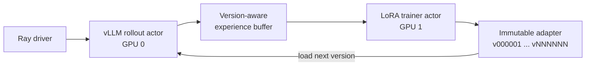

# rlite

`rlite` is a compact, single-node framework for understanding and reproducing
LLM policy optimization. It keeps the complete online-RL path visible—vLLM
rollout, verifiable rewards, grouped experience construction, policy update,
and versioned LoRA synchronization—without hiding it behind a large distributed
platform.

The project is intentionally small enough to trace one update end to end, while
still exercising the boundaries that matter in production RL systems: resource
isolation, backpressure, rollout-policy consistency, token alignment, memory-
bounded training, and inference/training weight synchronization.

## What is included

- **GRPO, DAPO and GSPO objectives** behind a common algorithm registry.
- **Ray resource orchestration** with one rollout actor and one trainer actor,
  each pinned to a GPU, plus a bounded experience buffer.
- **vLLM rollout** with Automatic Prefix Caching and LoRA serving.
- **Memory-bounded LoRA training** using sequence/token microbatches; the
  trainer actor exposes a backend boundary where FSDP can be added without
  changing rollout or experience construction.
- **Versioned synchronization**: every update produces an immutable adapter
  version; stale experience and non-monotonic policy loads fail explicitly.
- **Pluggable tasks, rewards and metrics**, with GSM8K as the reference task.
- **Hugging Face reference backend** for readable debugging and unit tests.

## Architecture



Training is synchronous by design. A rollout is tagged with the policy version
that generated it; the trainer accepts only that version, updates the adapter,
and advances the rollout actor exactly once. The small bounded buffer makes the
consistency rule and backpressure explicit rather than allowing silent policy
lag.

### Algorithm semantics

| Algorithm | Objective in rlite | Distinguishing behavior |
|---|---|---|
| GRPO | response-balanced clipped surrogate | group-normalized advantages |
| DAPO | asymmetric clip and global token mean | resamples zero-variance groups |
| GSPO | sequence-level clipped surrogate | length-normalized sequence ratio |

DAPO's token-level objective is combined across microbatches using response-
token weights, preserving a global token mean. GSPO computes the mean log-ratio
over each response before exponentiation and clipping. These details are tested
independently of the runtime.

## Prefix-aware grouped rollout

For `n=K` sampling, the supported `native` mode submits one vLLM request with
`SamplingParams(n=K)`. The experimental `leader` mode admits one child first,
then releases the remaining children after its first generated token. At that
point prompt prefill is complete, so followers can reuse cache-visible full KV
blocks through vLLM Automatic Prefix Caching.

This optimization deliberately relies on vLLM's block hashing, ownership and
reference counting. It does not fork KV-cache internals. Incomplete final prompt
blocks may still be recomputed, and the path is version-sensitive; benchmark it
again after upgrading vLLM.

## Quick start

```bash
pip install -e ".[dev,vllm]"
pytest -q

# Two-GPU Ray + vLLM run
rlite-ray-train --config configs/remote_ray_grpo_qwen1.5b.yaml
```

Switch `algo.name` to `dapo` or `gspo`, or use the corresponding checked-in
configuration. For local debugging without Ray/vLLM:

```bash
python -m rlite.train --config configs/gsm8k_grpo_lora_hf.yaml
```

The main configuration surfaces are:

```yaml
rollout:
  engine: vllm
  n_samples: 4
  enable_prefix_caching: true
  group_admission: leader     # native | leader
algo:
  name: grpo                  # grpo | dapo | gspo
trainer:
  micro_batch_size_per_gpu: 1
  max_tokens_per_micro_batch: 768
```

## Correctness boundaries

- Rewards join trajectories by `task_id`, never by list position.
- Response masks align policy ratios only to sampled response tokens.
- Empty, malformed or stale-policy batches fail explicitly.
- GRPO/GSPO reduce each response before the batch mean; long responses do not
  receive accidental extra weight. DAPO intentionally uses a global token mean.
- Adapter IDs are monotonic. Loading new weights also invalidates prefix cache,
  preventing KV blocks computed under old policy weights from crossing updates.
- The reported KL is between the current policy and rollout behavior policy; it
  is not a separate frozen-reference-model KL.

## Small-scale experiment

We ran completed GRPO and GSPO experiments with the same
Qwen2.5-1.5B-Instruct GSM8K setup (`K=4`, LoRA rank 16, seed 42) on two RTX
3090 GPUs. Evaluation uses a fixed 100-example held-out subset.


| Algorithm | Steps reported | Baseline | Best (step) | Last reported |
|---|---:|---:|---:|---:|
| GRPO | 200 | 58% | 71% (40) | 66% |
| GSPO | 200 | 58% | **72% (150/160)** | **69%** |

The experiment is a framework smoke test, not an algorithm leaderboard: it uses
one seed and a small evaluation set. Both reported runs completed 200 updates
without OOM or invalid-format outputs. Source points and the plotting command are in
[`experiments/`](experiments/README.md). Fuller runtime and memory notes are in
[`docs/experiment-report.md`](docs/experiment-report.md).

## Project map

```text
rlite/algos/       policy objectives and registry
rlite/runtime/     Ray actors and version-aware buffer
rlite/rollout/     Hugging Face and vLLM engines
rlite/trainers/    LoRA optimization backend
rlite/tasks/       task/reward/metric plugins
configs/           reproducible experiment configurations
tests/             objective, alignment and admission invariants
```

## Scope

`rlite` targets transparent single-node experiments. It is not a replacement
for multi-node training stacks: FSDP/ZeRO sharding, fault recovery, elastic
scheduling, asynchronous off-policy execution and cluster observability are
outside the current implementation.
