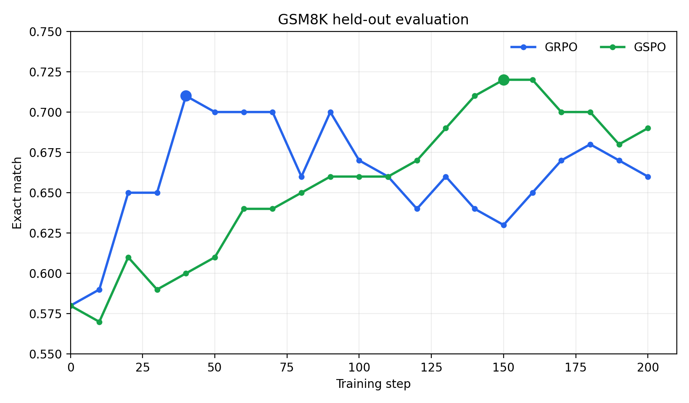
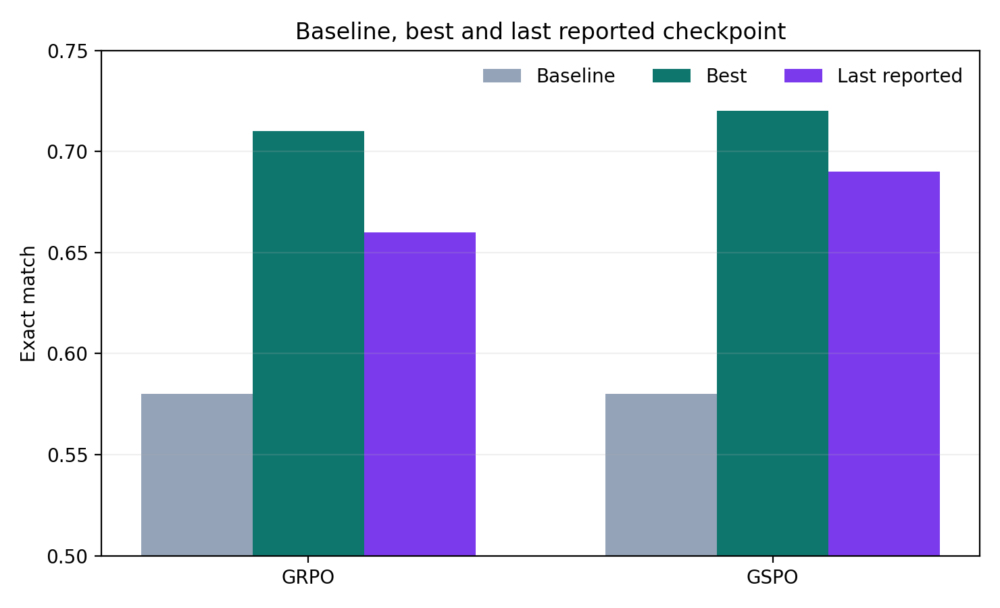

# GSM8K two-GPU experiment report

## Setup

| Item | Value |
|---|---|
| Hardware | 2 × RTX 3090 (24 GB) |
| Model | Qwen2.5-1.5B-Instruct |
| Training | LoRA rank 16, seed 42 |
| Rollout | vLLM, `K=4`, max 256 new tokens |
| Evaluation | fixed 100-example GSM8K test subset, greedy decoding |
| Placement | rollout actor on GPU 0, trainer actor on GPU 1 |

The comparison controls the model, prompt/reward implementation, rollout
configuration and evaluation set. It is a single-seed systems validation
rather than a statistically powered algorithm comparison.

## Quality statistics

| Algorithm | Reported steps | Baseline | Best | Best step | Last | Best gain |
|---|---:|---:|---:|---:|---:|---:|
| GRPO | 200 | 58% | 71% | 40 | 66% | +13 pp |
| GSPO | 200 | 58% | 72% | 150/160 | 69% | +14 pp |





## Systems observations

- GRPO completed 200 steps in approximately 98 minutes.
- GSPO completed 200 steps cleanly. Its final ten updates took 22.6--23.6
  seconds each, used eight trainer microbatches, and peaked at 4.72--5.16 GB of
  allocated trainer memory.
- All reported evaluation points had a 0% invalid-format rate. No reported run
  ended in OOM or NaN.

A larger study should additionally use multiple seeds and compare quality
against generated tokens and wall-clock time, not only optimizer steps.

## Reproduction

```bash
rlite-ray-train --config configs/remote_ray_grpo_qwen1.5b.yaml
rlite-ray-train --config configs/remote_ray_gspo_qwen1.5b.yaml
python scripts/plot_training.py
```

The plotted source values are in `experiments/gsm8k_seed42.csv`.
